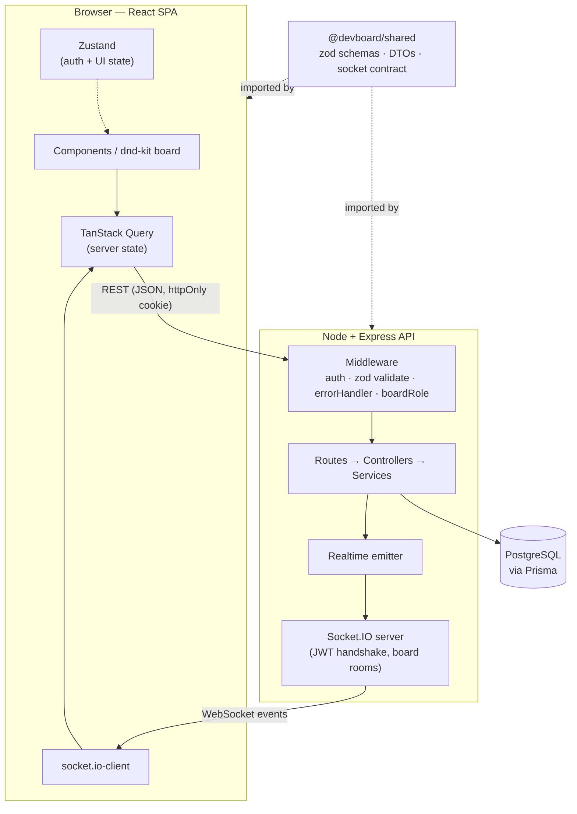

# DevBoard

A Kanban-style task & project management tool (think a lightweight Trello/Linear) with **real-time collaboration**. Create boards, drag cards across columns, assign work, label it, share boards by email with role-based access, and watch changes sync live across every connected client.

Built as a portfolio project to demonstrate clean full-stack architecture, production patterns (JWT refresh rotation, optimistic UI, typed end-to-end contracts), and a one-command local setup.

> **TL;DR:** `cp .env.example .env && docker compose up --build` → open http://localhost:5173 → sign in as `alice@devboard.dev` / `password123`.

---

## Table of contents

- [Features](#features)
- [Tech stack](#tech-stack)
- [Architecture](#architecture)
- [Project structure](#project-structure)
- [Getting started](#getting-started)
  - [Option A — Docker (one command)](#option-a--docker-one-command)
  - [Option B — Local dev](#option-b--local-dev)
- [Environment variables](#environment-variables)
- [API overview](#api-overview)
- [Real-time events](#real-time-events)
- [Testing](#testing)
- [Screenshots](#screenshots)
- [Tech decisions](#tech-decisions)
- [What I'd improve next](#what-id-improve-next)

---

## Features

- **Auth** — email/password register & login, JWT **access + refresh tokens**, refresh-token **rotation with reuse detection**, httpOnly refresh cookie, silent re-login on reload.
- **Boards / columns / cards** — multiple boards per user, default columns on creation, full CRUD.
- **Drag & drop** — reorder cards within a column and move them across columns (dnd-kit), with **optimistic updates** and rollback on failure.
- **Rich cards** — title, description, due date (with overdue styling), assignee, and color labels.
- **Sharing & roles** — invite teammates by email; **owner / editor / viewer** roles enforced on every endpoint. Viewers get a read-only board.
- **Real-time sync** — Socket.IO rooms per board; one user's move/edit appears instantly for all others.
- **Activity log** — every mutation is recorded and shown in a live feed.

---

## Tech stack

| Layer        | Choice                                                                 |
| ------------ | ---------------------------------------------------------------------- |
| Frontend     | React + TypeScript + Vite, Tailwind CSS, TanStack Query, Zustand, dnd-kit |
| Backend      | Node.js + Express + TypeScript                                         |
| Database     | PostgreSQL + Prisma ORM (migrations + seed)                            |
| Real-time    | Socket.IO                                                              |
| Auth         | JWT (access + refresh) with httpOnly cookies, bcrypt                   |
| Validation   | Zod schemas shared between client and server                          |
| Tests        | Jest + Supertest (backend)                                             |
| Tooling      | npm workspaces monorepo, Docker Compose                               |

---

## Architecture



**Request flow:** `Route → validate(zod) → requireAuth → requireBoardRole → Controller → Service → Prisma`. Services write to the DB, log an activity entry, and broadcast the canonical entity to the board's Socket.IO room. The client applies optimistic updates immediately and reconciles with both the REST response and the echoed socket event (idempotent upserts by id).

**Why `/shared`:** the same Zod schemas validate forms on the client and requests on the server, and the same DTO/socket-event types are imported by both — so a contract change is a single edit that fails to compile on both sides if mismatched.

---

## Project structure

```
devboard/
├─ docker-compose.yml         # postgres + server + client
├─ .env.example
├─ shared/                    # @devboard/shared (dual ESM+CJS build)
│  └─ src/
│     ├─ schemas/             # zod: auth, board, column, card, invite
│     ├─ types/               # enums, API envelope, DTOs
│     └─ socket-events.ts     # typed realtime contract
├─ server/                    # @devboard/server
│  ├─ prisma/                 # schema, migrations, seed
│  └─ src/
│     ├─ app.ts / index.ts    # testable app + http/socket bootstrap
│     ├─ config, lib, utils   # env, prisma, jwt, password, cookies
│     ├─ middleware/          # requireAuth, validate, errorHandler, boardRole
│     ├─ modules/             # auth, boards, columns, cards, invites, labels, activity
│     └─ realtime/            # socket server + emitter
└─ client/                    # @devboard/client
   └─ src/
      ├─ lib/                 # axios client, queryClient, socket, cn
      ├─ stores/              # zustand: auth, ui (toasts)
      ├─ components/          # ui kit + layout + state blocks
      └─ features/
         ├─ auth/             # login/register, guards, session bootstrap
         └─ boards/           # list, board view, dnd, card editor, sharing, activity
```

---

## Getting started

**Prerequisites:** Node ≥ 20. For Option A, Docker + Docker Compose. For Option B, a local PostgreSQL.

### Option A — Docker (one command)

```bash
cp .env.example .env
docker compose up --build
```

This starts Postgres, runs migrations automatically, builds and serves the API on **:4000** and the client on **:5173**.

Seed demo data (in a second terminal, once Postgres is healthy):

```bash
docker compose exec server npm run db:seed
```

Open **http://localhost:5173** and sign in with `alice@devboard.dev` / `password123` (or `bob@devboard.dev`).

### Option B — Local dev

```bash
# 1. install
npm install

# 2. start a Postgres (example via Docker; or use your own and set DATABASE_URL)
docker run --name devboard-pg -e POSTGRES_USER=devboard -e POSTGRES_PASSWORD=devboard \
  -e POSTGRES_DB=devboard -p 5432:5432 -d postgres:16-alpine

# 3. env
cp .env.example .env        # DATABASE_URL already points at localhost:5432

# 4. db
npm run db:migrate          # apply migrations
npm run db:seed             # demo data

# 5. run both apps (shared is built first automatically)
npm run dev                 # server :4000 + client :5173
```

---

## Environment variables

See [`.env.example`](./.env.example) for the full list. Key ones:

| Variable                              | Purpose                                            |
| ------------------------------------- | -------------------------------------------------- |
| `DATABASE_URL`                        | Prisma connection string                           |
| `JWT_ACCESS_SECRET` / `JWT_REFRESH_SECRET` | Token signing secrets (use long random values) |
| `ACCESS_TOKEN_TTL` / `REFRESH_TOKEN_TTL`   | e.g. `15m` / `7d`                              |
| `COOKIE_SECURE`                       | `true` when serving over HTTPS                     |
| `CLIENT_ORIGIN`                       | Allowed CORS origin(s)                             |
| `VITE_API_URL` / `VITE_SOCKET_URL`    | API + socket base URLs for the client              |

The server validates its environment with Zod on startup and **fails fast** if anything required is missing.

---

## API overview

All responses use a consistent envelope:

```jsonc
// success
{ "success": true, "data": { /* ... */ } }
// failure
{ "success": false, "error": { "code": "VALIDATION_ERROR", "message": "...", "details": { "email": ["Invalid email"] } } }
```

| Method & path                                   | Role    | Description                       |
| ----------------------------------------------- | ------- | -------------------------------- |
| `POST /api/auth/register` · `login` · `refresh` · `logout` · `GET /me` | —    | Auth + token rotation     |
| `GET/POST /api/boards`                          | —/auth  | List / create boards             |
| `GET/PATCH/DELETE /api/boards/:id`              | V/E/O   | Read / rename / delete board     |
| `POST/PATCH/DELETE .../columns[/:id]`           | Editor  | Column CRUD                      |
| `POST .../columns/:id/cards`                    | Editor  | Create card                      |
| `PATCH/DELETE .../cards/:id`, `PATCH .../cards/:id/move` | Editor | Update / delete / move card |
| `POST/DELETE .../labels[/:id]`                  | Editor  | Label CRUD                       |
| `GET .../members` · `.../activity`              | Viewer  | Members / activity feed          |
| `POST/DELETE .../invites[/:id]`, `PATCH/DELETE .../members/:userId` | Owner | Sharing & roles |
| `POST /api/invites/:token/accept`               | auth    | Accept an invite                 |

*(V = viewer, E = editor, O = owner — each role includes the ones below it.)*

---

## Real-time events

The client joins `board:<id>` after a membership check. The server emits canonical entities on every mutation:

`card:created` · `card:updated` · `card:moved` · `card:deleted` · `column:created` · `column:updated` · `column:deleted` · `board:updated` · `member:changed` · `activity:created`

Event names and payloads are defined once in `@devboard/shared/socket-events.ts` and typed on both ends.

---

## Testing

Backend tests are **hermetic** — Prisma is deep-mocked, so no database is required to run them.

```bash
npm test                      # or: npm test -w @devboard/server
```

Coverage focuses on the logic worth protecting:

- **Auth** — register conflict, login (no user-enumeration), refresh **rotation**, **reuse detection**, expiry, garbage tokens.
- **Authorization** — `requireBoardRole` (404 on non-membership, 403 on low role).
- **Board logic** — board creation shape, card-move guards, invite/member rules (owner protection).
- **HTTP plumbing** — success envelope, 400 with field details, 401, 404 (via Supertest).

---

## Screenshots

> _Placeholders — drop real screenshots/GIFs into `docs/` and update these._

| Boards dashboard | Board view (drag & drop) | Card editor | Sharing & roles |
| ---------------- | ------------------------ | ----------- | --------------- |
| _`docs/boards.png`_ | _`docs/board.png`_ | _`docs/card.png`_ | _`docs/share.png`_ |

A real-time demo GIF (two browsers side by side) lives at _`docs/realtime.gif`_.

---

## Tech decisions

- **Monorepo with a `/shared` package.** One source of truth for Zod schemas, DTOs, and the socket contract. The client validates forms with the exact schema the server enforces; a contract change breaks compilation on both sides. `shared` is built **dual ESM+CJS** so the Vite bundler resolves named exports statically while the CommonJS server keeps `require`.
- **Access token in memory, refresh token in an httpOnly cookie.** Limits XSS blast radius (no token in `localStorage`) and CSRF exposure (refresh cookie is `sameSite=lax`, scoped to `/api/auth`). Refresh tokens are stored **hashed** and **rotated** on every use; replaying a revoked token revokes the whole session family.
- **Fractional positions for ordering.** Cards/columns store a `Float` position; a reorder computes the midpoint between neighbors, so moving a card writes **one row** instead of renumbering the list.
- **Optimistic UI reconciled by a single source of truth.** Mutations patch the TanStack Query cache immediately and roll back on error; the server's canonical entity (via REST response *and* the echoed socket event, upserted by id) keeps every client convergent.
- **Roles as data, enforced in middleware.** `BoardMember` is the access-control source of truth; `requireBoardRole(minRole)` gates every board route and returns 404 (not 403) for non-members so board ids can't be probed.
- **Consistent error handling.** A single `ApiError` class + error middleware normalize Zod, Prisma (P2002/P2025), and operational errors into one response shape with stable machine codes.

---

## What I'd improve next

- **Server-authoritative reordering & rebalancing.** Move position math fully server-side and rebalance when fractional gaps get tiny; add per-board operation ordering to fully resolve concurrent drag races.
- **Integration tests against a real Postgres** (Testcontainers) to complement the mocked unit tests, plus **Playwright** E2E for the drag-and-drop and realtime flows.
- **Transactional email** for invites (currently the invite link is surfaced in-app/copied to clipboard) and a proper pending-invite inbox.
- **Presence & live cursors** — show who's viewing a board and where they're dragging.
- **Card detail depth** — comments, checklists, attachments, and activity per card.
- **Performance** — virtualized columns for very large boards, route-level code splitting, and an API rate limiter.
- **Observability** — structured logging, request tracing, and error reporting (e.g. Sentry).
- **CI/CD** — GitHub Actions to lint, typecheck, test, and build on every PR; preview deploys.

---

## License

MIT — see [`LICENSE`](./LICENSE).
